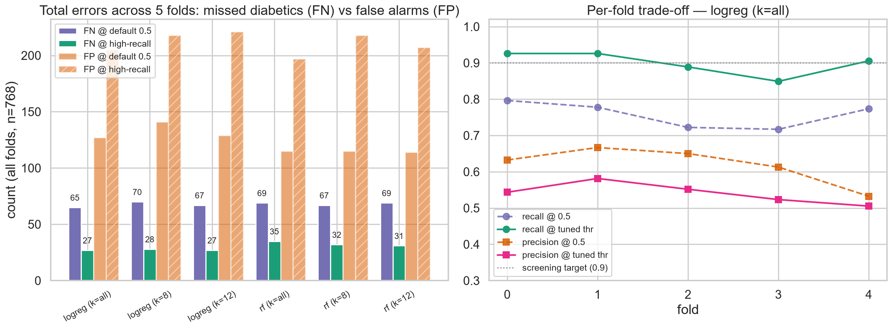
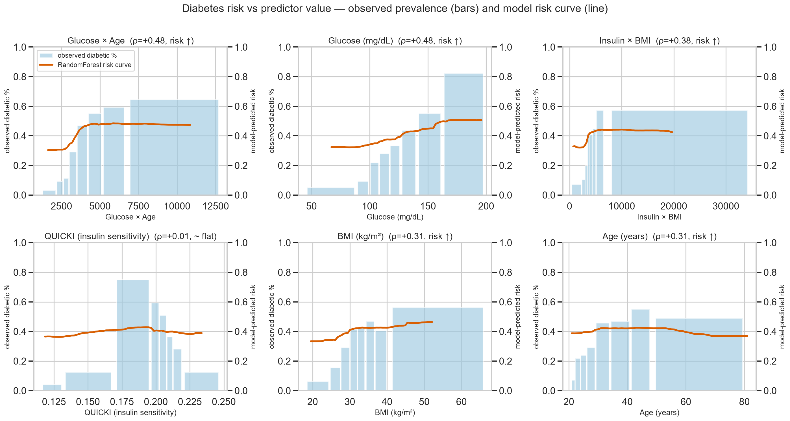
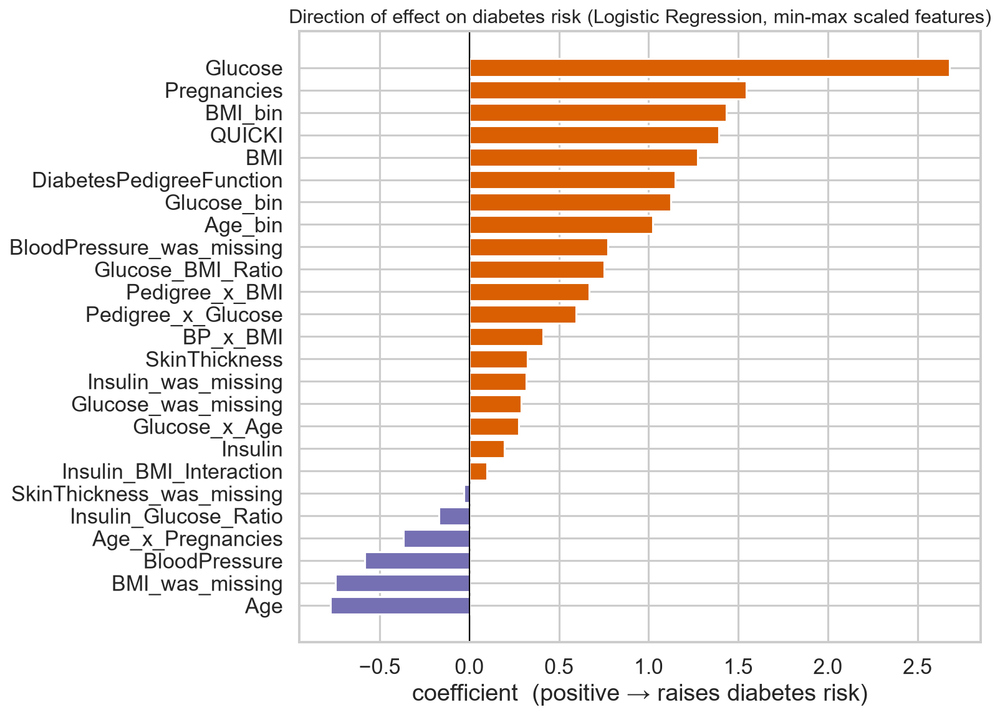

# Diabetes_ML


Diabetes risk prediction on the [Pima Indians Diabetes dataset](https://www.kaggle.com/datasets/uciml/pima-indians-diabetes-database) (768 x 9), with feature engineering, model training, and evaluation **parallelised across a Dask distributed cluster** (1 scheduler + 4 worker processes — a multi-node-ready topology; swap `LocalCluster` for remote scheduler/worker addresses to span physical machines).

## 🎯 Project Overview

This project provides:
- **Quick Data Analysis** — dataset size, class balance (500/268 → 34.9% positive), and hidden missingness (biologically impossible zeros treated as missing: Insulin 48.7%, SkinThickness 29.6%, BloodPressure 4.6%, BMI 1.4%, Glucose 0.7%)
- **Parallel Feature Engineering** — 25 features built on a worker: missingness flags, median imputation, insulin-resistance composites (Glucose x Age, Insulin x BMI, QUICKI proxy), clinical bins (ADA glucose, WHO BMI)
- **Parallel Model Training** — 30 jobs fanned out via `client.map`: RandomForest vs Logistic Regression x chi-squared feature selection (k = 8/12/all) x 5 stratified folds
- **High-Recall Screening Mode** — per-fold decision thresholds tuned on out-of-fold training predictions to catch >= 90% of diabetics (medical screening: minimise missed cases)
- **Evaluation** — per-fold scoring on workers (ROC-AUC, PR-AUC, balanced accuracy, F1), aggregated at the scheduler
- **Risk-Trend Analysis** — empirical risk curves showing how diabetes probability moves as each predictor's value rises or falls

## 📁 Project Structure

```
Diabetes_ML/
│
├── data/
│   └── pima-indians-diabetes.csv   # Dataset (768 rows x 9 cols)
│
├── src/
│   ├── pipeline.py                 # Full cluster pipeline (analysis -> features -> training -> evaluation)
│   ├── plots.py                    # Fold-level CV analysis figures
│   └── trends.py                   # Predictor risk-trend figures (main takeaway)
│
├── results/
│   ├── cv_results.csv              # Per-fold results (30 runs)
│   └── feature_importance.csv      # Ranked predictors (full-data RF refit)
│
├── README.md
├── requirements.txt
├── LICENSE
└── .gitignore
```

## 📊 Results

Mean metrics over 5 stratified folds (class imbalance handled with `class_weight="balanced"` + stratified CV):

| model | chi² k | ROC-AUC | PR-AUC | Bal. Acc | F1 |
|---|---|---|---|---|---|
| **LogReg** | all | **0.842** | 0.723 | 0.752 | 0.680 |
| RF | all | 0.836 | 0.732 | 0.756 | 0.685 |
| LogReg | 12 | 0.835 | 0.719 | 0.746 | 0.672 |
| RF | 12 | 0.835 | **0.736** | **0.757** | **0.684** |
| RF | 8 | 0.832 | 0.739 | 0.760 | 0.688 |
| LogReg | 8 | 0.815 | 0.684 | 0.728 | 0.654 |

**Key findings:**

- RandomForest and Logistic Regression are statistically tied (~0.84 ROC-AUC); LogReg on **all 25 engineered features** is the single strongest config, while RF edges ahead on PR-AUC and balanced accuracy thanks to class weighting.
- chi² feature selection did **not** beat using all features (k=all ≥ k=12 for both models on ROC-AUC) — with only 25 correlated features the reduction mostly discards signal; the per-config spread across folds is larger than the gap between configs.
- Top predictors (full-data RF refit): `Glucose_x_Age` (0.13), `Glucose` (0.10), `Insulin_BMI_Interaction` (0.08), `QUICKI` (0.06), `BMI` (0.06) — glucose-dominant, with insulin-resistance composites adding real signal over raw features.

## 📈 Fold-level analysis


Generated by `src/plots.py` from `results/cv_results.csv`.

## ⚕️ High-recall screening mode

For medical screening, missed diabetics (false negatives) cost more than false alarms. Each fold's decision threshold is therefore tuned **on out-of-fold training predictions only** to catch >= 90% of diabetics, then applied to the untouched test fold — no leakage:

| model | chi² k | threshold | recall | precision | F1 |
|---|---|---|---|---|---|
| **LogReg** | all | **0.343** | **0.899** | 0.541 | 0.675 |
| LogReg | 12 | 0.345 | 0.899 | 0.523 | 0.661 |
| LogReg | 8 | 0.339 | 0.895 | 0.526 | 0.662 |
| RF | 12 | 0.291 | 0.884 | 0.537 | 0.667 |
| RF | 8 | 0.290 | 0.880 | 0.523 | 0.655 |
| RF | all | 0.302 | 0.869 | 0.545 | 0.668 |

At this operating point the model flags roughly half of screened patients (precision 0.54 vs the 34.9% base rate — a ~1.55x lift) while still catching ~90% of true diabetics, an appropriate trade-off for a first-pass screening tool; confirmed diagnosis would follow up flagged patients.

**Before vs after (aggregate over all 5 folds, n = 768):**

| model | chi² k | recall @0.5 | recall @HR | precision @0.5 | precision @HR | FN @0.5 | FN @HR | FP @0.5 | FP @HR |
|---|---|---|---|---|---|---|---|---|---|
| **LogReg** | all | 0.757 | **0.899** | 0.619 | 0.541 | 65 | **27** | 127 | 205 |
| LogReg | 12 | 0.750 | **0.899** | 0.611 | 0.523 | 67 | **27** | 129 | 221 |
| LogReg | 8 | 0.739 | **0.895** | 0.592 | 0.526 | 70 | **28** | 141 | 218 |
| RF | 12 | 0.743 | **0.884** | 0.640 | 0.537 | 69 | **31** | 114 | 207 |
| RF | 8 | 0.750 | **0.880** | 0.639 | 0.523 | 67 | **32** | 115 | 218 |
| RF | all | 0.743 | **0.869** | 0.639 | 0.545 | 69 | **35** | 115 | 197 |
| **totals** | | | | | | **407** | **180** | **741** | **1266** |

Switching to the screening threshold cuts missed diabetics by **56% (407 → 180)**; the price is +71% false alarms (741 → 1,266), i.e. ~525 extra false alarms to prevent ~227 missed diagnoses — the intended trade for a screening tool.



## 📊 Risk trends — how each predictor moves diabetes risk

**Main takeaway:** diabetes risk rises steadily with glucose — observed prevalence climbs from ~5% at glucose ≈ 50–90 mg/dL to ~82% above ~155 mg/dL, and the model's risk curve tracks the same monotonic climb. The interaction Glucose x Age (a young person with high glucose is already high-risk) and BMI show the same upward shape; QUICKI (insulin sensitivity) is surprisingly flat/non-monotonic in this cohort, and Age rises then plateaus (older members of this 1994 cohort were diagnosed earlier in life).



Direction of every feature's multivariate effect (LogReg, min-max scaled):



Generated by `src/trends.py`.

## ⚙️ Setup

```bash
git clone https://github.com/Oluchi-Otuadinma/Diabetes_ML.git
cd Diabetes_ML
python -m venv .venv && source .venv/bin/activate   # Windows: .venv\Scripts\activate
pip install -r requirements.txt
```

## 🚀 Usage

```bash
python src/pipeline.py
```

The pipeline spins up the Dask cluster, runs the quick data analysis, distributes feature engineering, fans out 30 train/score jobs (2 models x 3 chi²-k x 5 folds), aggregates the metrics, and writes `results/cv_results.csv` + `results/feature_importance.csv`.

For the fold-level and risk-trend plots:

```bash
python src/plots.py    # fold-level analysis -> assets/*.png
python src/trends.py   # risk curves + direction chart -> assets/*.png
```

## 📄 License

Distributed under the [MIT License](LICENSE).
